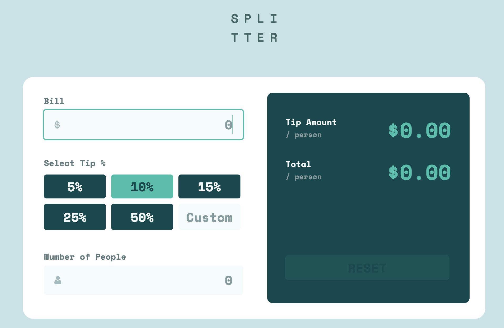

# Frontend Mentor - Tip calculator app solution

This is a solution to the [Tip calculator app challenge on Frontend Mentor](https://www.frontendmentor.io/challenges/tip-calculator-app-ugJNGbJUX). Frontend Mentor challenges help you improve your coding skills by building realistic projects.

## Table of contents

- [Overview](#overview)
  - [The challenge](#the-challenge)
  - [Screenshot](#screenshot)
  - [Links](#links)
- [My process](#my-process)
  - [Built with](#built-with)
  - [What I learned](#what-i-learned)
  - [Useful resources](#useful-resources)
- [Author](#author)

**Note: Delete this note and update the table of contents based on what sections you keep.**

## Overview

### The challenge

Users should be able to:

- View the optimal layout for the app depending on their device's screen size
- See hover states for all interactive elements on the page
- Calculate the correct tip and total cost of the bill per person

### Screenshot



### Links

- [Solution URL](https://github.com/jleegunn/tip-calculator-app)
- [Live Site URL](https://jleegunn.github.io/tip-calculator-app/)

## My process

### Built with

- Semantic HTML5 markup
- CSS custom properties
- Flexbox
- CSS Grid
- Javascript

**Note: These are just examples. Delete this note and replace the list above with your own choices**

### What I learned

One of the problems I got stuck on was trying to change the color of the .tip button class when one button
is clicked, then when a new button is clicked the old button would revert back to its original color state.

```html
<button class="tip" value="5">5%</button>
<button class="tip" value="10">10%</button>
<button class="tip" value="15">15%</button>
<button class="tip" value="25">25%</button>
<button class="tip" value="50">50%</button>
```
```css
.activeBtn {
  background-color: var(--Strong_cyan);
  color: var(--Very_dark_cyan);
}
.tip {
  background-color: var(--Very_dark_cyan);
  color: var(--Lightest_grayish_cyan);
}
```
```js
document.querySelectorAll(".tip").forEach(item => {
  item.addEventListener("click", () => {
    tip = item.value;
    item.classList.add("activeBtn");
  })
  document.addEventListener("click", event => {
    if (tip != item.value){
      item.classList.remove("activeBtn");
    }
  });
});
```

### Useful resources

- [Example resource 1](https://www.codexworld.com/how-to/toggle-show-hide-element-using-javascript/) - This helped me figure out how to toggle between an active and nonactive state for the .tip class buttons.
- [Example resource 2](https://www.javascripttutorial.net/javascript-dom/javascript-style/) - This really helped me figure out the style guide differences between CSS and Javascript. 

## Author

- Website - [Jamie Counsellor](tbd)
